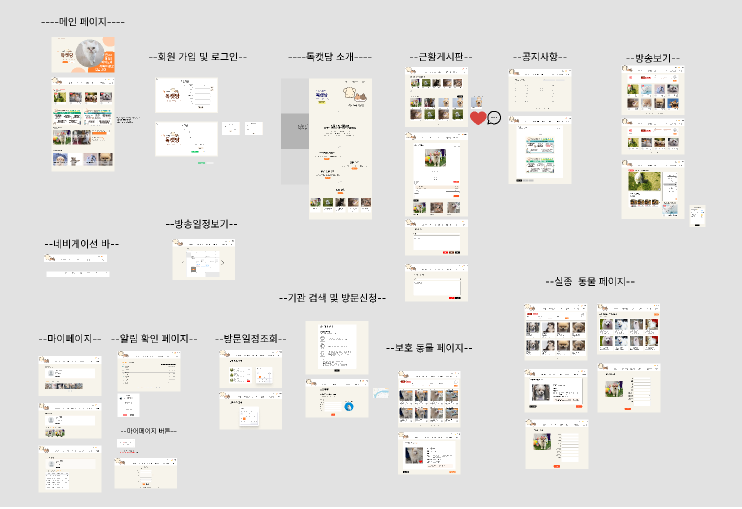
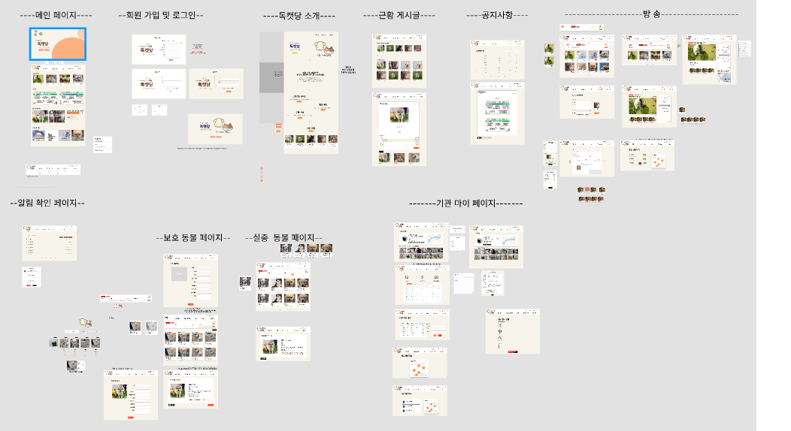
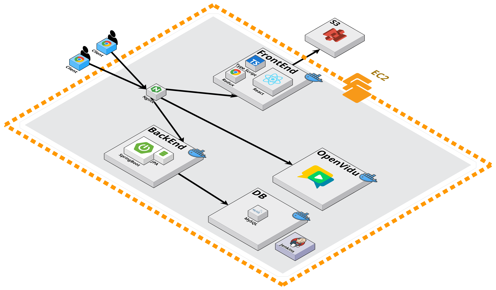

# 🐶독캣당🐱

> 유기견 & 유기묘 입양 독려하는 방송 서비스

# 목차

1. [결과물](#결과물)
2. [팀원 소개](#팀원-소개)
3. [서비스 화면](#서비스-화면)
4. [주요 기능](#주요-기능)
5. [개발 환경](#개발-환경)
6. [기술 소개](#기술-소개)
7. [설계 문서](#설계-문서)

# 결과물

- 📽 [UCC]()

- 🎤 [중간발표 자료]()

- 🎤 [최종발표 자료]()

# 📺서비스 화면

## 메인 페이지

## 마이 페이지

# 팀원 소개

## 😎 역할 분담

**Frontend**

- 손유정 :

- 최도훈 :

- 박영진 :

**Backend**

- 위동민 :

- 박정호 :

- 탁윤희 :

# 주요 기능

# 개발 환경

## ⚙ Management Tool

- 형상 관리 : Gitlab
- 이슈 관리 : Jira
- 커뮤니케이션 : Mattermost, Webex, Notion, Discord
- 디자인 : Figma, PowerPoint

## 💻 IDE

- Visual Studio Code `1.18.1`
- IntelliJ `11.0.19`

## 📱 Frontend

- React `18.2.0`
- Vite `^5.0.8`
- Typescript `5.2.2`

## 💾 Backend

- Springboot `2.7.13`
- Lombok
- Spring Data JPA
- Spring Data Redis(lettuce)
- Spring Web
- Springdoc-openapi-ui `1.6.11`
- Oauth2
- Swagger 3.0.0
- Oauth2
- Redis
- MySql 8.0.34

## Infra

- AWS S3
- AWS EC2
- Nginx 1.18.0
- Docker 20.10.12
- Ubuntu 20.04.6 LTS
- CertBot(CA Certificates)
- SSL

# 기술 소개

# ⚙ 설계 문서

## 🎨 와이어프레임

### - 개인 와이어프레임

### - 기관 와이어프레임

## 📃 요구사항 명세서

- [요구사항 명세서](https://docs.google.com/spreadsheets/d/1ZLI7sLIl_ei3g1UbczJ_970uipbRo7nZNDduVcPJtCk/edit#gid=434359381)

## 📝 API 명세서

- [API 명세서](https://www.notion.so/iamyouj/API-4f85636b6f18405a8b1870d5c22c27f3)

## 📏 ERD

## 📐 시스템 아키텍처

## 🧾컴포넌트

### FE

📦src
┣ 📂assets  
┃ ┣ 🖼adoption-info-stage1.png
┃ ┣ 🖼adoption-info-stage2.png
┃ ┣ 🖼adoption-info-stage3.png
┃ ┣ 🖼auth-image.png
┃ ┣ 🖼condition.png
┃ ┣ 🖼Dandie.jpg
┃ ┣ 🖼defaultProfile.png
┃ ┣ 🖼dog.jpg
┃ ┣ 🖼googleLoginBtn.png
┃ ┣ 🖼main-logo-big.png
┃ ┣ 🖼main-logo.png
┃ ┣ 🖼main-logo.webp
┃ ┣ 🖼MungBTI.png
┃ ┣ 🖼naverLoginBtn.png
┃ ┣ 🖼paw-prints.png
┃ ┣ 🖼refresh.png
┃ ┣ 🖼Search.png
┣ 📂components
┃ ┣ 📂common
┃ ┃ ┣ 📜 AlertModal.tsx
┃ ┃ ┣ 📜 Button.tsx
┃ ┃ ┣ 📜 Design.tsx
┃ ┃ ┣ 📜 Error.tsx
┃ ┃ ┣ 📜 Footer.tsx
┃ ┃ ┣ 📜 Icons.tsx
┃ ┃ ┣ 📜 LoadingOrError.tsx
┃ ┃ ┣ 📜 NavBar.tsx
┃ ┃ ┣ 📜 Pagination.tsx
┃ ┃ ┣ 📜 TextSearch.tsx
┃ ┃ ┣ 📜 Title.tsx
┃ ┣ 📂users
┃ ┃ ┣ 📜 Card.tsx
┃ ┃ ┣ 📜 ContentBox.tsx
┃ ┃ ┣ 📜 KakaoMap.tsx
┃ ┃ ┣ 📜 Line.tsx
┃ ┃ ┣ 📜 ProfileBox.tsx
┃ ┃ ┣ 📜 ProfileEditModal.tsx
┃ ┃ ┣ 📜 Title.tsx
┃ ┣ 📂animalinfo
┃ ┃ ┣ 📜Input.tsx
┃ ┃ ┣ 📜LikeButton.tsx
┃ ┃ ┣ 📜search.css
┃ ┃ ┣ 📜style.tsx
┃ ┃ ┣ 📂lostanimals
┃ ┃ ┃ ┣ 📜LostAnimalCard.tsx
┃ ┃ ┃ ┣ 📜LostAnimalSearch.tsx
┃ ┃ ┣ 📂mungbti
┃ ┃ ┃ ┣ 📜 AnimalMatching.tsx
┃ ┃ ┣ 📂savedanimals
┃ ┃ ┃ ┣ 📜SaveAnimalCard.tsx
┃ ┃ ┃ ┣ 📜SaveAnimalSearch.tsx
┃ ┃ ┃ ┣ 📜SavedAnimalList.tsx
┃ ┣ 📂 articles
┃ ┃ ┣ 📜ArticleCard.tsx
┃ ┃ ┣ 📜 ArticleContent.tsx
┃ ┃ ┣ 📜 ArticleEditor.tsx
┃ ┃ ┣ 📜 ArticleInterface.ts
┃ ┃ ┣ 📜 ArticleList.tsx
┃ ┃ ┣ 📜 Likes.tsx
┃ ┃ ┣ 📜 PreviewModal.tsx
┃ ┃ ┣ 📂comments
┃ ┃ ┃ ┣ 📜Comment.tsx
┃ ┃ ┃ ┣ 📜CommentForm.tsx
┃ ┃ ┃ ┣ 📜CommentList.tsx
┃ ┣ 📂Broadcast
┃ ┃ ┣ 📜 AnimalList.tsx
┃ ┃ ┣ 📜 AnimalSearchForBroadcast.tsx
┃ ┃ ┣ 📜 BroadcastDetail.tsx
┃ ┃ ┣ 📜 BroadcastForm.tsx
┃ ┃ ┣ 📜 Chat.tsx
┃ ┃ ┣ 📜 MyVideo.tsx
┃ ┃ ┣ 📜 SessionComponent.tsx
┃ ┃ ┣ 📜 simpleEncrypt.ts
┃ ┣ 📂notificationss
┃ ┃ ┣ 📜NotiModal.tsx
┃ ┣ 📂visits
┃ ┃ ┣ 📜 AdoptionInfoModal.tsx
┃ ┃ ┣ 📜 ReservationInfo.tsx
┃ ┃ ┣ 📜 ReservationList.tsx
┃ ┃ ┣ 📜ScheduleCard.tsx
┣ 📂pages
┃ ┣ 📂 users
┃ ┃ ┣ 📜SignUpPage.tsx
┃ ┃ ┣ 📜SignUpPage.tsx
┃ ┃ ┣ 📜ProfilePage.tsx
┃ ┃ ┣ 📜VisitManagementPage.tsx
┃ ┣ 📂 home
┃ ┃ ┣ 📜HomePage.tsx
┃ ┃ ┣ 📜LandingPage.tsx
┃ ┣ 📂animals
┃ ┃ ┣ 📜SavedAnimalManagementPage.tsx
┃ ┃ ┣ 📜StyleDetail.tsx
┃ ┃ ┣ 📂lostanimals
┃ ┃ ┃ ┣ 📜LostAnimalDetailPage.tsx
┃ ┃ ┃ ┣ 📜LostAnimalFormPage.tsx
┃ ┃ ┃ ┣ 📜LostAnimalListPage.tsx
┃ ┃ ┃ ┣ 📜LostAnimalUpdatePage.tsx
┃ ┃ ┣ 📂mungbti
┃ ┃ ┃ ┣ 📜MungBTIPage.tsx
┃ ┃ ┣ 📂savedanimals
┃ ┃ ┃ ┣ 📜AnimalDetailPage.tsx
┃ ┃ ┃ ┣ 📜AnimalFormPage.tsx
┃ ┃ ┃ ┣ 📜AnimalListPage.tsx
┃ ┃ ┃ ┣ 📜AnimalUpdatePage.tsx
┃ ┣ 📂 visits
┃ ┃ ┣ 📜VisitManagementPage.tsx
┃ ┃ ┣ 📜VisitReservationListPage.tsx
┃ ┃ ┣ 📜VisitReservationPage.tsx
┃ ┣ 📂articles
┃ ┃ ┣ 📜ArticleDetailPage.tsx
┃ ┃ ┣ 📜ArticleListPage.tsx
┃ ┃ ┣ 📜articleLoader.ts
┃ ┃ ┣ 📜ArticleWritePage.tsx
┃ ┣ 📂broadcast
┃ ┃ ┣ 📜BoradcastListPage.tsx
┃ ┃ ┣ 📜BroadCastPage.tsx
┃ ┣ 📂notice
┃ ┃ ┣ 📜NoticeListPage.tsx
┃ ┣ 📂admin
┃ ┃ ┣ 📜AdminPage.tsx
┃ ┣ 📂message
┃ ┃ ┣ 📜MessageListPage.tsx
┣ 📂store
┃ ┣ 📜 broadcastSlice.ts
┃ ┣ 📜 store.ts
┣ 📂utils
┃ ┣ 📜articleAPI.ts
┃ ┣ 📜axios.ts
┃ ┣ 📜broadcastAPI.ts
┃ ┣ 📜LostAPI.ts
┃ ┣ 📜notificationsAPI.ts
┃ ┣ 📜S3.ts
┃ ┣ 📜SaveAPI.ts
┃ ┣ 📜tanstackQuery.ts
┃ ┣ 📜uitl.ts
┃ ┣ 📜UserAPI.ts
┃ ┣ 📜VisitAPI.ts
┣ 📜App.tsx
┗ 📜main.tsx
